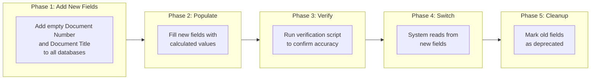
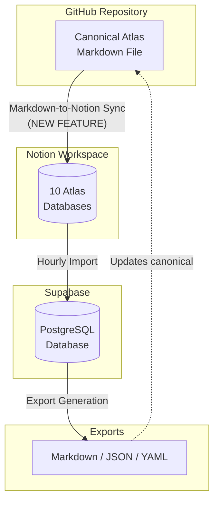

# Markdown Sync - Summary & Notion Property Migration

## Executive Summary

We are standardizing how document information is stored across Notion databases to reduce complexity and enable a new Markdown-to-Notion sync feature. **This migration is designed to be completely safe with zero data loss** - we add new fields alongside existing ones, verify everything works, and only switch over after confirmation.

---

## The Problem: Inconsistent Property Names

The Atlas is spread across 10 Notion databases. Over time, each database developed different names for the same information:

| Information     | Scopes   | Agent Scope DB  | Sections & Primary Docs |
| --------------- | -------- | --------------- | ----------------------- |
| Document Number | `Doc No` | `Formal Doc ID` | `Doc No (or Temp Name)` |
| Document Name   | `Name`   | `Document Name` | `Doc No (or Temp Name)` |

This inconsistency creates maintenance burden - every feature we build must handle all these variations, making the code complex and error-prone.

**Solution**: Introduce two standardized properties that work the same across all databases:

- `Document Number` (same name everywhere)
- `Document Title` (same name everywhere)

---

## Migration Safety: How We Protect Your Data

### Key Safety Guarantees

1. **Old properties are never modified or deleted** - They remain intact as a backup throughout the entire migration
2. **Dual-read during transition** - The system reads from both old and new fields, preferring new when available
3. **Verification before switching** - Automated scripts confirm new fields match expected values before we switch
4. **Rollback at any point** - If something goes wrong, we simply continue using the old fields

### What Gets Changed vs. What Stays Safe

| Action                                | Risk Level                       |
| ------------------------------------- | -------------------------------- |
| Add new empty properties to databases | None - just adds columns         |
| Populate new properties with values   | None - old properties untouched  |
| System reads from new properties      | Low - falls back to old if empty |
| Mark old properties as deprecated     | None - data still accessible     |

---

## New Feature: Markdown-to-Notion Sync

### What It Does

The **canonical Atlas** (the official version) lives as a Markdown file in GitHub. The team edits in Notion for convenience. This new sync feature enables changes made to the Markdown file to flow back into Notion, completing a full round-trip:

### How the Sync Works (High-Level)

1. **Load** - The system loads the Markdown file from GitHub
2. **Compare** - It compares against what's currently in Notion (via Supabase)
3. **Detect Changes** - Automatically finds new, modified, moved, or deleted documents
4. **Preview** - Shows you exactly what will change before doing anything
5. **Sync** - Creates, updates, or archives pages in Notion as needed
6. **Import Back** - Automatically pulls changes back to Supabase so exports are updated

### Why This Matters

- External contributors can propose Atlas changes via GitHub without Notion access
- Bulk edits can be done efficiently in a text editor
- Complete audit trail through Git history
- Team members continue using Notion for daily editing

---

## Control Switches During Migration

During the migration period, we have configuration switches to control system behavior:

### 1. Import Mode Switch

Controls which Notion properties the system reads when importing to Supabase:

| Mode                            | Description                                | When to Use                 |
| ------------------------------- | ------------------------------------------ | --------------------------- |
| **Old fields only**             | Reads from existing properties             | Before migration starts     |
| **Prefer new, fallback to old** | Tries new fields first, uses old as backup | During migration            |
| **New fields only**             | Reads only from standardized properties    | After migration is complete |

### 2. Sync Mode Switch

Controls how the Markdown-to-Notion sync detects changes:

| Mode                         | Description                                  | When to Use                 |
| ---------------------------- | -------------------------------------------- | --------------------------- |
| **Dynamic values** (default) | Calculates document numbers/names on the fly | During migration            |
| **Stored values**            | Uses values stored in database               | After migration is verified |

These switches allow us to safely transition while maintaining the ability to fall back if needed.

---

## Migration Timeline

| Step | Action                                       | Duration  | Risk             |
| ---- | -------------------------------------------- | --------- | ---------------- |
| 1    | Add new properties to all 10 databases       | ~5 min    | None             |
| 2    | Run population script to fill new properties | ~40 min   | None             |
| 3    | Import data to Supabase                      | ~15 min   | None             |
| 4    | Run verification script                      | ~5 min    | None             |
| 5    | Switch import mode to prefer new fields      | Immediate | Low (reversible) |
| 6    | Monitor for issues                           | 1-2 weeks | None             |
| 7    | Mark old properties as deprecated            | ~10 min   | None             |

**Total active time**: ~1-2 hours  
**Monitoring period**: 1-2 weeks before final cleanup

---

## Summary

- **What**: Standardize property names across all Atlas Notion databases
- **Why**: Reduce complexity and enable new sync features
- **Risk**: Zero - old properties preserved, verified before switching
- **New capability**: Markdown changes can now sync back to Notion
- **Timeline**: ~1 hour of work + 1-2 weeks of monitoring
