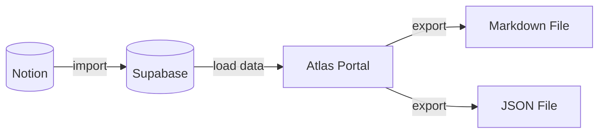
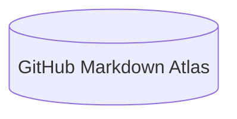
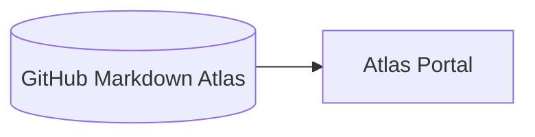

# Current Data Flow

```mermaid
flowchart LR
    Notion[(Notion)] -->|import| Supabase[(Supabase)]
    Supabase -->|load data| Portal[Atlas Portal]
    Portal -->|export| Markdown[Markdown File]
    Portal -->|export| JSON[JSON File]
```

```mermaid
flowchart LR
    GitHub[(GitHub Markdown Atlas)]
```

# Future Data Flow

```mermaid
flowchart LR
    GitHub[(GitHub Markdown Atlas)] --> Portal[Atlas Portal]
```
